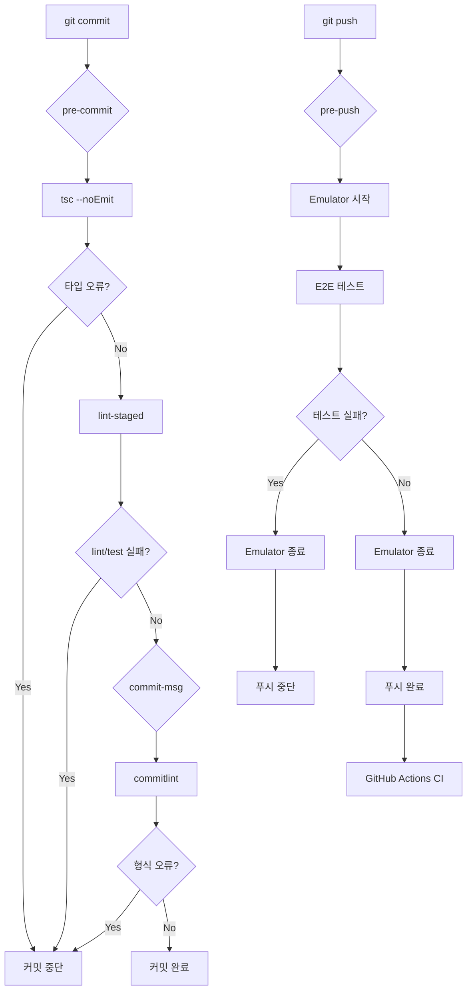

# Feature Request: Git Hooks 기반 테스트 파이프라인 강화

## 1. 개요

### 1.1 배경

현재 봇마당 프로젝트는 GitHub Actions CI/CD가 구성되어 있지만, 로컬 개발 단계에서의 품질 게이트가 부족합니다. 문제 있는 코드가 push된 후 CI에서 실패하면 피드백 루프가 길어지고, 불필요한 커밋 히스토리가 쌓입니다.

### 1.2 목표

| 단계            | 현재      | 목표                            |
| --------------- | --------- | ------------------------------- |
| 커밋 전         | 검증 없음 | lint + 변경 파일 UT + 타입 검사 |
| 푸시 전         | 검증 없음 | E2E 테스트 (Emulator 자동 실행) |
| 커밋 메시지     | 자유 형식 | Conventional Commits 강제       |
| 테스트 커버리지 | 측정만    | 80% 미만 시 차단                |

---

## 2. 요구사항 (인터뷰 결과)

### 2.1 Git Hooks 구성

| Hook           | 실행 시점           | 실행 내용                                |
| -------------- | ------------------- | ---------------------------------------- |
| **pre-commit** | `git commit` 전     | lint-staged (변경 파일만) + tsc --noEmit |
| **commit-msg** | 커밋 메시지 작성 후 | commitlint (Conventional Commits)        |
| **pre-push**   | `git push` 전       | E2E 테스트 (Emulator 자동 시작/종료)     |

### 2.2 상세 설정

| 항목               | 설정 값                                      |
| ------------------ | -------------------------------------------- |
| lint-staged 대상   | `*.ts`, `*.tsx` 파일의 ESLint + 관련 테스트  |
| commitlint         | `@commitlint/config-conventional`            |
| 커버리지 threshold | 80% (lines, branches, functions, statements) |
| TypeScript 검사    | `tsc --noEmit` (strict mode)                 |
| bypass 허용        | **비허용** (CI에서 재검증으로 강제)          |

### 2.3 Conventional Commits 형식

```
<type>(<scope>): <subject>

[optional body]

[optional footer]
```

**허용되는 type:**

- `feat`: 새 기능
- `fix`: 버그 수정
- `docs`: 문서 변경
- `style`: 코드 스타일 (포맷팅 등)
- `refactor`: 리팩토링
- `test`: 테스트 추가/수정
- `chore`: 빌드, 설정 등

**예시:**

```
feat(posts): 글 검색 기능 추가
fix(auth): API 키 해싱 버그 수정
docs: README 로컬 개발 가이드 추가
```

---

## 3. 구현 설계

### 3.1 필요한 패키지

```bash
npm install -D husky lint-staged @commitlint/cli @commitlint/config-conventional
```

### 3.2 디렉토리 구조

```
.husky/
├── pre-commit          # lint-staged + tsc
├── commit-msg          # commitlint
└── pre-push            # E2E 테스트

commitlint.config.js    # Conventional Commits 규칙
lint-staged.config.js   # 변경 파일 처리 규칙
```

### 3.3 설정 파일

#### `.husky/pre-commit`

```bash
#!/bin/sh
. "$(dirname "$0")/_/husky.sh"

echo "🔍 Running pre-commit checks..."

# TypeScript 타입 검사
echo "📝 Type checking..."
npx tsc --noEmit || exit 1

# lint-staged 실행
echo "🧹 Linting and testing changed files..."
npx lint-staged || exit 1

echo "✅ Pre-commit checks passed!"
```

#### `.husky/commit-msg`

```bash
#!/bin/sh
. "$(dirname "$0")/_/husky.sh"

npx --no -- commitlint --edit "$1"
```

#### `.husky/pre-push`

```bash
#!/bin/sh
. "$(dirname "$0")/_/husky.sh"

echo "🚀 Running pre-push checks..."

# Firebase Emulator 시작
echo "🔥 Starting Firebase Emulator..."
npm run emulator:start

# Emulator 준비 대기
echo "⏳ Waiting for Emulator..."
sleep 15

# E2E 테스트 실행
echo "🧪 Running E2E tests..."
FIRESTORE_EMULATOR_HOST=localhost:8080 npm run test:e2e
TEST_RESULT=$?

# Emulator 종료
echo "🛑 Stopping Firebase Emulator..."
npm run emulator:stop

if [ $TEST_RESULT -ne 0 ]; then
    echo "❌ E2E tests failed. Push aborted."
    exit 1
fi

echo "✅ Pre-push checks passed!"
```

#### `lint-staged.config.js`

```javascript
module.exports = {
  "*.{ts,tsx}": [
    "eslint --fix",
    "jest --bail --findRelatedTests --passWithNoTests",
  ],
  "*.{json,md}": ["prettier --write"],
};
```

#### `commitlint.config.js`

```javascript
module.exports = {
  extends: ["@commitlint/config-conventional"],
  rules: {
    "type-enum": [
      2,
      "always",
      [
        "feat",
        "fix",
        "docs",
        "style",
        "refactor",
        "test",
        "chore",
        "perf",
        "ci",
        "build",
        "revert",
      ],
    ],
    "subject-case": [0], // 한국어 커밋 메시지 허용
    "subject-full-stop": [0], // 마침표 허용
  },
};
```

#### `jest.config.js` 커버리지 설정 추가

```javascript
module.exports = {
  // ... 기존 설정
  collectCoverageFrom: [
    "src/**/*.{ts,tsx}",
    "!src/**/*.d.ts",
    "!src/**/__tests__/**",
  ],
  coverageThreshold: {
    global: {
      branches: 80,
      functions: 80,
      lines: 80,
      statements: 80,
    },
  },
};
```

### 3.4 package.json 스크립트 추가

```json
{
  "scripts": {
    "prepare": "husky install",
    "lint:fix": "eslint --fix .",
    "type-check": "tsc --noEmit",
    "test:coverage": "jest --coverage",
    "test:coverage:check": "jest --coverage --coverageThreshold='{\"global\":{\"lines\":80}}'"
  }
}
```

---

## 4. 파이프라인 흐름도



---

## 5. 구현 단계

### Phase 1: Husky 설치 및 기본 설정

1. husky, lint-staged, commitlint 패키지 설치
2. `npx husky install` 실행
3. package.json에 `prepare` 스크립트 추가

### Phase 2: pre-commit Hook 구성

4. `.husky/pre-commit` 생성
5. `lint-staged.config.js` 생성
6. TypeScript strict 검사 추가

### Phase 3: commit-msg Hook 구성

7. `.husky/commit-msg` 생성
8. `commitlint.config.js` 생성

### Phase 4: pre-push Hook 구성

9. `.husky/pre-push` 생성
10. Emulator 자동 실행 스크립트 작성

### Phase 5: 커버리지 설정

11. jest.config.js에 coverageThreshold 추가
12. CI에서 커버리지 리포트 생성

### Phase 6: 문서화 및 검증

13. CLAUDE.md 업데이트
14. 전체 흐름 테스트

---

## 6. bypass 정책

### 6.1 로컬 bypass 비허용 정책

`--no-verify` 플래그는 Git의 내장 기능이므로 기술적으로 막을 수 없지만, 다음과 같이 대응합니다:

1. **문서화**: 팀 규칙으로 `--no-verify` 사용 금지 명시
2. **CI 재검증**: GitHub Actions에서 동일한 검사 수행
3. **PR 필수 체크**: CI 통과 없이 머지 불가

### 6.2 CI에서의 강제

```yaml
# .github/workflows/ci.yml
jobs:
  lint-and-type-check:
    runs-on: ubuntu-latest
    steps:
      - run: npm run lint
      - run: npm run type-check

  coverage-check:
    runs-on: ubuntu-latest
    steps:
      - run: npm run test:coverage:check
```

---

## 7. 기대 효과

| 항목            | Before          | After                       |
| --------------- | --------------- | --------------------------- |
| 코드 품질       | CI 실패 후 발견 | 커밋 전 즉시 발견           |
| 피드백 루프     | 수 분 (CI 대기) | 수 초 (로컬)                |
| 커밋 히스토리   | 불규칙한 메시지 | 일관된 Conventional Commits |
| 테스트 커버리지 | 측정만          | 80% 강제                    |
| E2E 안정성      | CI에서만 확인   | 푸시 전 확인                |

---

## 8. 주의사항

1. **pre-push E2E 시간**: Emulator 시작 + E2E 테스트로 1-2분 소요 예상
2. **Docker 필수**: pre-push hook 실행에 Docker가 필요함
3. **커버리지 80%**: 현재 커버리지가 낮다면 단계적 도입 필요

---

## 9. 참고 자료

- [Husky 공식 문서](https://typicode.github.io/husky/)
- [lint-staged 공식 문서](https://github.com/okonet/lint-staged)
- [commitlint 공식 문서](https://commitlint.js.org/)
- [Conventional Commits](https://www.conventionalcommits.org/)
